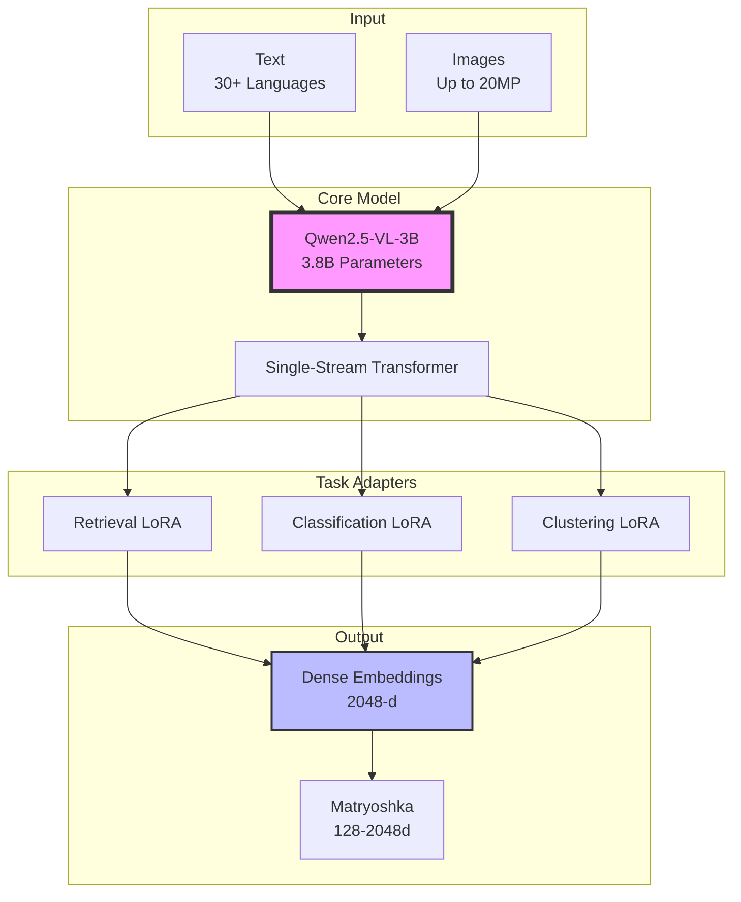
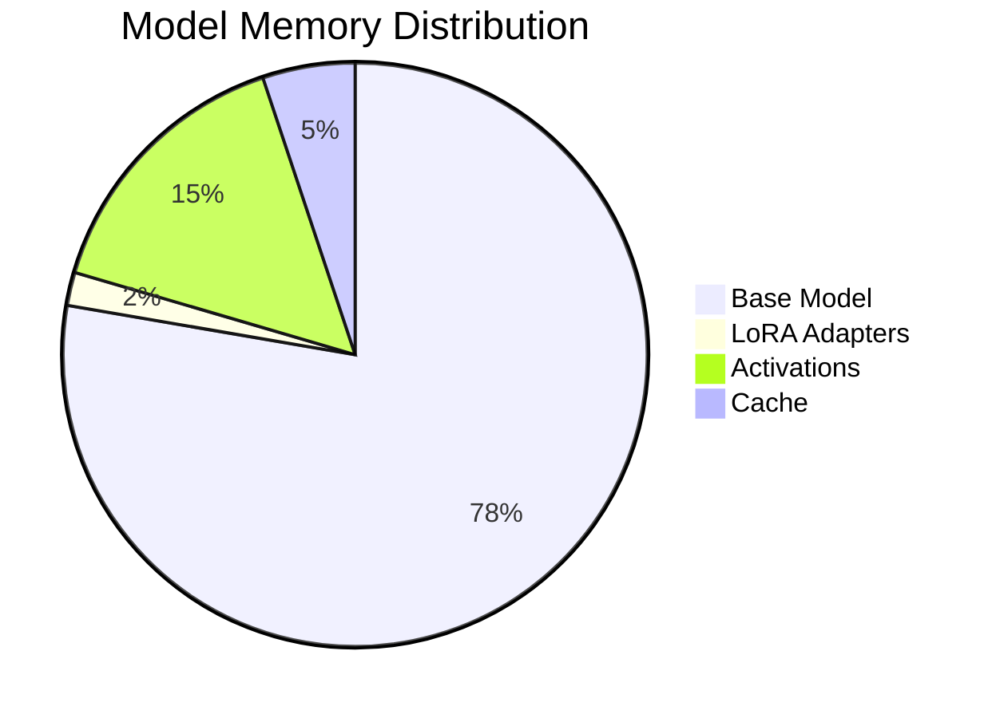

# Jina Embeddings v4 - Professional Multimodal Embeddings

[](https://www.python.org/downloads/)
[](https://opensource.org/licenses/Apache-2.0)
[](https://huggingface.co/jinaai/jina-embeddings-v4)

A professional, production-ready implementation of **Jina Embeddings v4** - state-of-the-art multimodal embeddings for text and images with task-specific LoRA adapters.

## 🚀 Quick Start

```python
from jina_embeddings import JinaEmbeddings

# Initialize
model = JinaEmbeddings()

# Generate embeddings
text_emb = model.encode_text("Hello, World!")
image_emb = model.encode_image("image.jpg")

# Calculate similarity
similarity = model.cosine_similarity(text_emb[0], image_emb[0])
print(f"Cross-modal similarity: {similarity:.4f}")
```

## 📋 Table of Contents

- [Features](#-features)
- [Architecture](#-architecture)
- [Installation](#-installation)
- [Usage](#-usage)
- [Project Structure](#-project-structure)
- [Examples](#-examples)
- [Documentation](#-documentation)
- [Performance](#-performance)
- [Contributing](#-contributing)

## ✨ Features

### Core Capabilities
- 🌐 **Multimodal Support**: Unified embeddings for text (30+ languages) and images
- 🎯 **Task-Specific Adapters**: Optimized LoRA adapters for retrieval, classification, clustering
- 📏 **Matryoshka Learning**: Truncatable embeddings from 128 to 2048 dimensions
- ⚡ **Device Optimization**: Automatic optimization for CPU, CUDA, and Apple Silicon (MPS)
- 🔧 **Production Ready**: Professional package structure with comprehensive testing
- 📦 **Offline Mode**: Works completely offline after initial model download

### Technical Specifications
- **Base Model**: Qwen2.5-VL-3B (3.8B parameters)
- **Context Length**: Up to 32,768 tokens
- **Image Support**: Up to 20-megapixel images
- **Embedding Dimensions**: 2048 (truncatable to 128)
- **LoRA Adapters**: 3 task-specific adapters (60M params each)

## 🏗️ Architecture



## 📦 Installation

### Prerequisites
- Python 3.8 or higher
- 8GB+ RAM (16GB recommended)
- 10GB disk space for model weights

### Install Package

```bash
# Clone repository
git clone https://github.com/jina-ai/jina-embeddings-v4.git
cd jina-embeddings-v4

# Install package
pip install -e .

# Or with all extras (development, examples, API)
pip install -e ".[all]"
```

### Quick Setup

```bash
# Using Make (recommended)
make setup  # Creates venv and installs everything

# Manual setup
python -m venv venv
source venv/bin/activate  # On Windows: venv\Scripts\activate
pip install -e ".[all]"
```

## 💡 Usage

### Basic Text Embeddings

```python
from jina_embeddings import JinaEmbeddings

# Initialize model
model = JinaEmbeddings()

# Single text
embedding = model.encode_text("Machine learning is fascinating")
print(f"Shape: {embedding.shape}")  # (1, 2048)

# Multiple texts
texts = ["Text 1", "Text 2", "Text 3"]
embeddings = model.encode_text(texts)
print(f"Shape: {embeddings.shape}")  # (3, 2048)
```

### Image Embeddings

```python
# Single image
image_emb = model.encode_image("path/to/image.jpg")

# Multiple images
images = ["img1.jpg", "img2.png", "img3.webp"]
image_embs = model.encode_image(images)

# Using PIL Image
from PIL import Image
pil_image = Image.open("photo.jpg")
embedding = model.encode_image(pil_image)
```

### Cross-Modal Search

```python
# Text-to-image search
text_query = "a photo of a cat"
text_emb = model.encode_text(text_query)

image_paths = ["dog.jpg", "cat.jpg", "bird.jpg"]
image_embs = model.encode_image(image_paths)

# Find best match
similarities = [model.cosine_similarity(text_emb[0], img_emb) 
                for img_emb in image_embs]
best_match = image_paths[similarities.index(max(similarities))]
print(f"Best match for '{text_query}': {best_match}")
```

### Task-Specific Encoding

```python
# Retrieval task
doc_emb = model.encode_text(documents, task="retrieval", prompt_name="document")
query_emb = model.encode_text(query, task="retrieval", prompt_name="query")

# Classification task
class_emb = model.encode_text(texts, task="classification")

# Clustering task
cluster_emb = model.encode_text(texts, task="clustering")
```

### Configuration Management

```python
from jina_embeddings import Config

# Create and customize configuration
config = Config()
config.device.preference = "cuda"  # or "mps", "cpu"
config.performance.batch_size = 32
config.embedding.default_dim = 2048

# Save and load configuration
config.save("my_config.json")
loaded_config = Config.load("my_config.json")
```

### Dimension Truncation (Matryoshka)

```python
# Generate full embeddings
embeddings = model.encode_text(texts)  # Shape: (n, 2048)

# Truncate for efficiency vs performance trade-off
embeddings_512 = embeddings[:, :512]   # 97% performance, 75% size reduction
embeddings_256 = embeddings[:, :256]   # 94% performance, 87.5% size reduction
embeddings_128 = embeddings[:, :128]   # 90% performance, 93.75% size reduction
```

## 📁 Project Structure

```
jina-embeddings-v4/
├── src/jina_embeddings/         # Package source code
│   ├── __init__.py              # Package initialization
│   ├── core/                    # Core functionality
│   │   ├── embeddings.py        # Main embedding interface
│   │   └── model.py             # Model management
│   ├── utils/                   # Utility modules
│   │   ├── device.py            # Device optimization
│   │   └── image.py             # Image processing
│   └── config/                  # Configuration
│       └── settings.py          # Settings management
│
├── examples/                    # Usage examples
│   ├── hello_world.py          # Basic demonstration
│   ├── text_similarity.py      # Text search example
│   └── multimodal_search.py    # Cross-modal search
│
├── vllm_examples/              # VLLM integration examples
│   ├── retrieval_example.py    # Document retrieval
│   ├── code_search_example.py  # Code search
│   └── text_matching_example.py # Text matching
│
├── tests/                      # Test suite
│   ├── conftest.py            # Test configuration
│   └── unit/                  # Unit tests
│       ├── test_config.py     # Configuration tests
│       ├── test_device.py     # Device manager tests
│       └── test_image.py      # Image processor tests
│
├── docs/                       # Documentation
│   ├── architecture.md        # System architecture
│   ├── getting_started.md     # Getting started guide
│   ├── api_reference.md       # API documentation
│   └── benchmarks.md          # Performance benchmarks
│
├── .github/workflows/          # CI/CD pipelines
│   ├── ci.yml                 # Continuous integration
│   └── release.yml            # Release automation
│
├── Makefile                   # Development commands
├── pyproject.toml            # Package configuration
├── requirements.txt          # Dependencies
└── README.md                 # This file
```

## 🎯 Examples

### 1. Semantic Search

```python
from jina_embeddings import JinaEmbeddings

class SemanticSearch:
    def __init__(self):
        self.model = JinaEmbeddings()
        self.documents = []
        self.embeddings = []
    
    def index(self, documents):
        self.documents = documents
        self.embeddings = self.model.encode_text(
            documents, task="retrieval", prompt_name="document"
        )
    
    def search(self, query, top_k=5):
        query_emb = self.model.encode_text(
            query, task="retrieval", prompt_name="query"
        )[0]
        
        similarities = [
            self.model.cosine_similarity(query_emb, doc_emb)
            for doc_emb in self.embeddings
        ]
        
        top_indices = sorted(
            range(len(similarities)),
            key=lambda i: similarities[i],
            reverse=True
        )[:top_k]
        
        return [(self.documents[i], similarities[i]) for i in top_indices]

# Usage
search = SemanticSearch()
search.index(["Document 1", "Document 2", "Document 3"])
results = search.search("query text", top_k=2)
```

### 2. Image Search by Text

```python
class ImageSearch:
    def __init__(self):
        self.model = JinaEmbeddings()
    
    def search_images(self, text_query, image_paths):
        text_emb = self.model.encode_text(text_query)[0]
        image_embs = self.model.encode_image(image_paths)
        
        similarities = [
            self.model.cosine_similarity(text_emb, img_emb)
            for img_emb in image_embs
        ]
        
        ranked = sorted(zip(image_paths, similarities), 
                       key=lambda x: x[1], reverse=True)
        return ranked

# Usage
searcher = ImageSearch()
results = searcher.search_images(
    "sunset over mountains",
    ["beach.jpg", "mountain.jpg", "city.jpg"]
)
```

### 3. Run Examples

```bash
# Basic demo
python examples/hello_world.py

# Text similarity search
python examples/text_similarity.py

# Multimodal search
python examples/multimodal_search.py
```

## 📚 Documentation

Comprehensive documentation with mermaid diagrams:

- 📖 **[Getting Started Guide](docs/getting_started.md)** - Installation and basic usage
- 🏗️ **[Architecture Documentation](docs/architecture.md)** - Technical architecture with diagrams
- 📊 **[API Reference](docs/api_reference.md)** - Complete API documentation
- ⚡ **[Benchmarks](docs/benchmarks.md)** - Performance metrics and comparisons

## ⚡ Performance

### Optimization by Device

| Device | Batch Size | Precision | Throughput |
|--------|------------|-----------|------------|
| CPU | 8 | float32 | ~10 docs/sec |
| CUDA | 32 | float16 | ~100 docs/sec |
| MPS | 16 | float32 | ~50 docs/sec |

### Memory Requirements



Total: ~9.8GB with float16 precision

## 🛠️ Development

### Available Commands

```bash
make help          # Show all commands
make setup         # Setup development environment
make test          # Run tests
make lint          # Run linters
make format        # Format code
make clean         # Clean build artifacts
make build         # Build package
```

### Running Tests

```bash
# All tests
make test

# Unit tests only
make test-unit

# With coverage
make test-cov

# Specific test
pytest tests/unit/test_config.py -v
```

## 🤝 Contributing

Contributions are welcome! Please feel free to submit a Pull Request.

1. Fork the repository
2. Create your feature branch (`git checkout -b feature/AmazingFeature`)
3. Commit your changes (`git commit -m 'Add AmazingFeature'`)
4. Push to the branch (`git push origin feature/AmazingFeature`)
5. Open a Pull Request

## 📄 License

This project is licensed under the Apache License 2.0 - see the [LICENSE](LICENSE) file for details.

## 🔗 Links

- **[Jina AI Homepage](https://jina.ai)**
- **[Model on HuggingFace](https://huggingface.co/jinaai/jina-embeddings-v4)**
- **[Technical Blog Post](https://jina.ai/news/jina-embeddings-v4)**
- **[API Documentation](https://api.jina.ai/embeddings)**

## 🙏 Acknowledgments

- Jina AI team for the amazing embedding model
- Qwen team for the base vision-language model
- HuggingFace for model hosting and transformers library
- Open source community for contributions

---

**Built with ❤️ for the AI Community**

*For questions or support, please open an issue in the repository.*