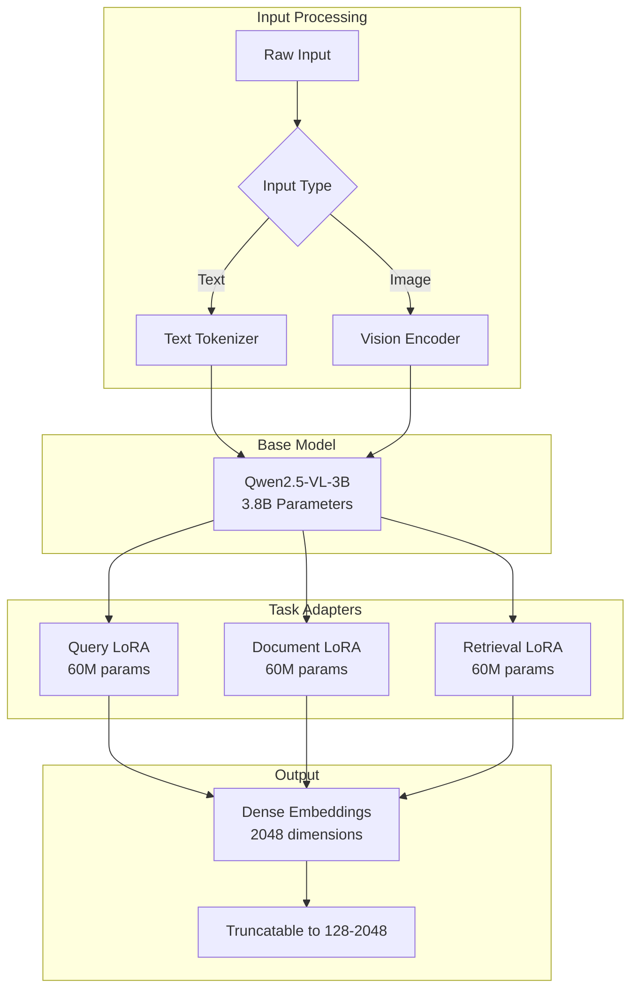
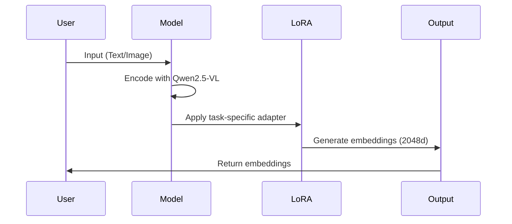
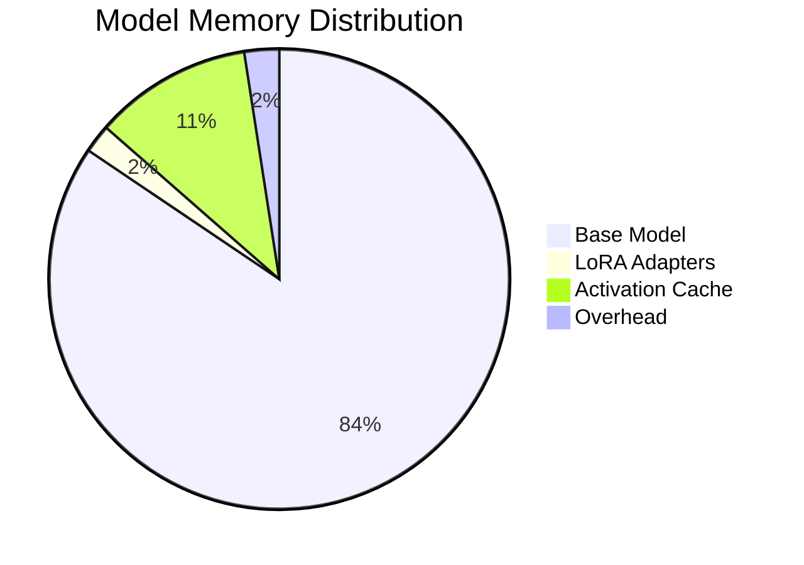

# Jina Embeddings v4 Architecture

## Overview

Jina Embeddings v4 is a state-of-the-art universal embedding model that handles text, images, and multimodal content through a unified architecture.

## Core Architecture



## Component Details

### 1. Base Model: Qwen2.5-VL-3B

The foundation of Jina Embeddings v4 is the Qwen2.5-VL-3B model:

- **Parameters**: 3.8 billion
- **Architecture**: Vision-Language Transformer
- **Context Length**: Up to 32,768 tokens with FlashAttention-2
- **Image Support**: Up to 20-megapixel images

### 2. LoRA Adapters

Three task-specific Low-Rank Adaptation (LoRA) modules:

| Adapter | Parameters | Purpose |
|---------|------------|---------|
| Query LoRA | 60M | Optimized for query encoding |
| Document LoRA | 60M | Optimized for document encoding |
| Retrieval LoRA | 60M | Optimized for retrieval tasks |

### 3. Input Processing

#### Text Processing
- **Tokenizer**: Based on Qwen tokenizer
- **Languages**: 30+ languages supported
- **Max Tokens**: 32,768 with FlashAttention-2

#### Image Processing
- **Resolution**: Up to 20 megapixels
- **Formats**: JPEG, PNG, BMP, TIFF, WebP
- **Preprocessing**: Automatic resizing and normalization

### 4. Embedding Generation



## Embedding Characteristics

### Dimensions
- **Default**: 2048 dimensions
- **Truncatable**: Can be reduced to 128-2048 dimensions
- **Performance**: Minimal loss even at 128 dimensions

### Similarity Metrics
- **Cosine Similarity**: Primary metric for comparing embeddings
- **Dot Product**: Alternative for normalized embeddings
- **Euclidean Distance**: Supported but not recommended

## Memory Requirements



- **Total**: ~9GB with float16 precision
- **Minimum RAM**: 8GB (with optimizations)
- **Recommended RAM**: 16GB for optimal performance

## Performance Optimizations

### 1. Precision
- **Float16**: Default for memory efficiency
- **Float32**: Available for higher precision
- **Int8**: Experimental quantization support

### 2. Hardware Acceleration
- **Apple Silicon (MPS)**: Native support for M1/M2 chips
- **CUDA**: Full support for NVIDIA GPUs
- **CPU**: Fallback with optimized operations

### 3. Batching Strategy
```python
# Optimal batch sizes by hardware
batch_sizes = {
    "mps": 8,     # Apple Silicon
    "cuda": 16,   # NVIDIA GPU
    "cpu": 4      # CPU only
}
```

## Multimodal Fusion

The model achieves cross-modal understanding through:

1. **Shared Representation Space**: Text and images mapped to same space
2. **Contrastive Learning**: Alignment of related text-image pairs
3. **Cross-Attention**: Bidirectional attention between modalities

```mermaid
graph LR
    A[Text: "cat"] --> C[Shared Space]
    B[Image: 🐱] --> C
    C --> D[Similar Embeddings]
    D --> E[High Similarity Score]
```

## Use Case Optimization

### Text Search
```python
config = {
    "task": "retrieval",
    "prompt_name": "query",
    "truncate_dim": 512  # Faster search
}
```

### Image Search
```python
config = {
    "task": "retrieval",
    "batch_size": 8,
    "precision": "float16"
}
```

### Cross-Modal Search
```python
config = {
    "task": "retrieval",
    "normalize": True,
    "temperature": 0.07
}
```

## Comparison with Previous Versions

| Feature | v2 | v3 | v4 |
|---------|----|----|----| 
| Parameters | 137M | 570M | 3.98B |
| Max Context | 8K | 8K | 32K |
| Image Support | ❌ | Limited | Full |
| Languages | 20+ | 30+ | 30+ |
| Embedding Dim | 768 | 1024 | 2048 |
| Truncatable | ❌ | ❌ | ✅ |

## Future Directions

1. **Quantization**: Further model compression
2. **Streaming**: Real-time embedding generation
3. **Video Support**: Extension to video understanding
4. **3D Vision**: Support for 3D scene understanding

---

*Last Updated: 2025*