# Jina Embeddings v4 - System Architecture

## Overview

Jina Embeddings v4 is a state-of-the-art multimodal embedding model that unifies text and image processing through a single transformer architecture with task-specific LoRA adapters.

## High-Level Architecture


## Component Architecture

### 1. Input Processing Pipeline


### 2. Transformer Architecture


### 3. LoRA Adapter Architecture

```mermaid
graph LR
    subgraph "LoRA Module"
        A[Base Weights<br/>Frozen] --> B[Original Output]
        A --> C[LoRA Down<br/>4096→64]
        C --> D[Activation<br/>ReLU]
        D --> E[LoRA Up<br/>64→4096]
        E --> F[Scale α/r]
        B & F --> G[Add]
        G --> H[Adapted Output]
    end
    
    style A fill:#ddd,stroke:#333,stroke-width:2px
    style E fill:#fcc,stroke:#333,stroke-width:2px
```



## Data Flow Architecture


## Memory Architecture


## Processing Pipeline


## Task-Specific Processing


## Device Optimization Strategy


## Matryoshka Representation Learning


## Cross-Modal Alignment

```mermaid
graph LR
    subgraph "Unified Embedding Space"
        A[Text: "A red car"] --> C[Encoder]
        B[Image: 🚗] --> C
        C --> D[Shared Vector Space]
        D --> E[Text Vector<br/>2048-d]
        D --> F[Image Vector<br/>2048-d]
        E -.->|Cosine Similarity| G[0.92]
        F -.->|High Alignment| G
    end
    
    style D fill:#ffd,stroke:#333,stroke-width:2px
    style G fill:#afa,stroke:#333,stroke-width:2px
```

## Performance Characteristics


## API Integration Flow


## Optimization Techniques

| Technique | Implementation | Benefit |
|-----------|---------------|---------|
| FlashAttention-2 | Fused attention kernels | 2-3x speedup |
| Mixed Precision | FP16 compute, FP32 accumulate | 50% memory saving |
| KV-Cache | Cached key-value pairs | Faster generation |
| Batch Processing | Dynamic batching | 4x throughput |
| CPU Offloading | Move inactive weights to RAM | Larger batch sizes |
| Gradient Checkpointing | N/A (inference only) | - |

## Comparison with Alternatives

```mermaid
graph TD
    subgraph "Embedding Models Comparison"
        A[Jina-v4<br/>3.98B params<br/>2048-d] 
        B[OpenAI Ada<br/>Unknown<br/>1536-d]
        C[Cohere-v3<br/>Unknown<br/>1024-d]
        D[BGE-M3<br/>560M params<br/>1024-d]
        
        A --> E[Advantages:<br/>• Multimodal<br/>• Open source<br/>• Matryoshka<br/>• 32K context]
    end
    
    style A fill:#afa,stroke:#333,stroke-width:3px
```



## Implementation Details

### Package Structure
```
src/jina_embeddings/
├── core/
│   ├── embeddings.py    # Main API interface
│   └── model.py         # Model management
├── utils/
│   ├── device.py        # Hardware optimization
│   └── image.py         # Image preprocessing
└── config/
    └── settings.py      # Configuration management
```

### Key Classes
- `JinaEmbeddings`: High-level API for embedding generation
- `EmbeddingModel`: Low-level model wrapper
- `DeviceManager`: Automatic hardware optimization
- `ImageProcessor`: Image validation and preprocessing
- `Config`: Centralized configuration management

## Future Architecture Enhancements

1. **Quantization Support**: INT8/INT4 for edge deployment
2. **Streaming Mode**: Token-by-token generation
3. **Multi-GPU**: Data parallel processing
4. **ONNX Export**: Cross-platform deployment
5. **TensorRT**: NVIDIA inference optimization

---

*Architecture Documentation - Jina Embeddings v4*