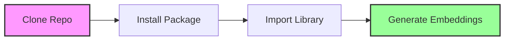
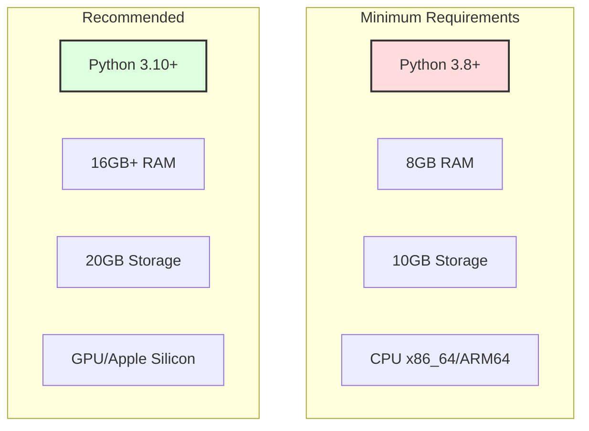
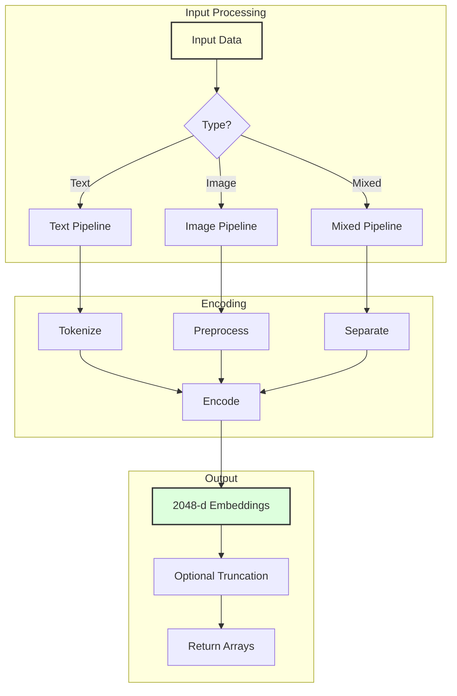
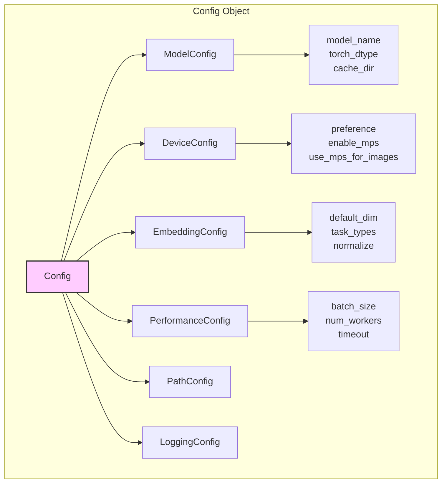
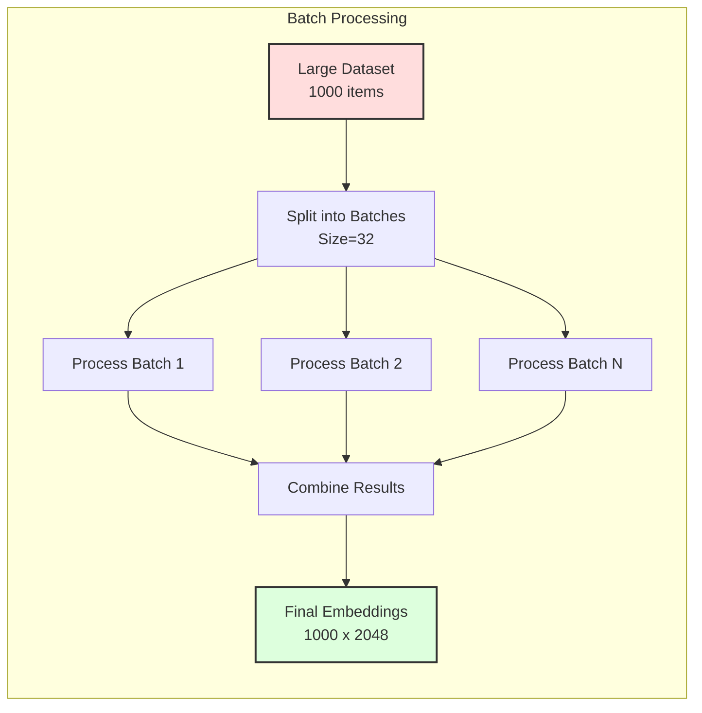
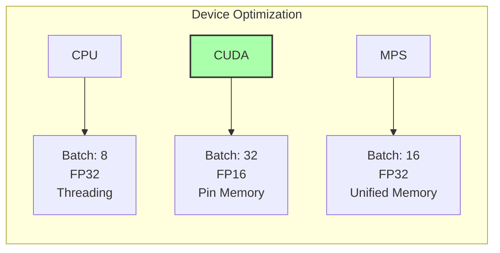
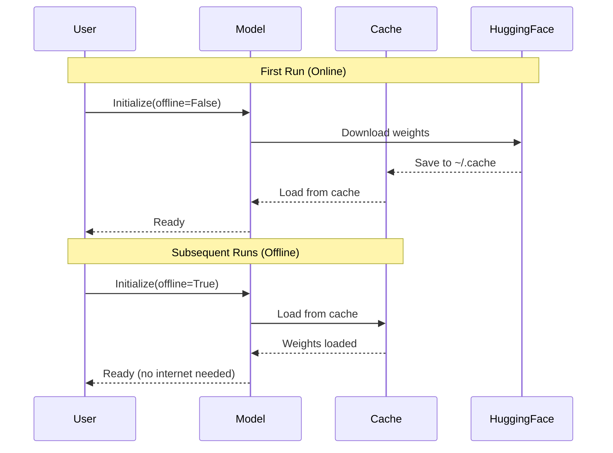
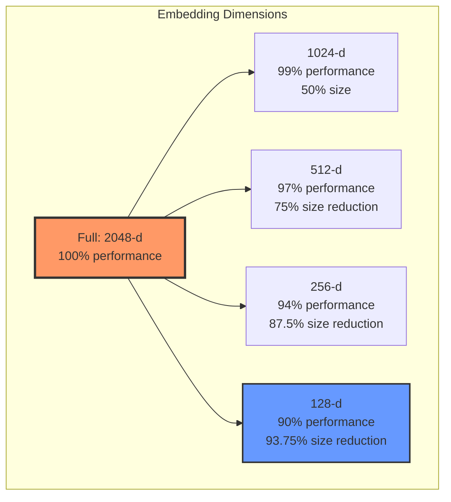
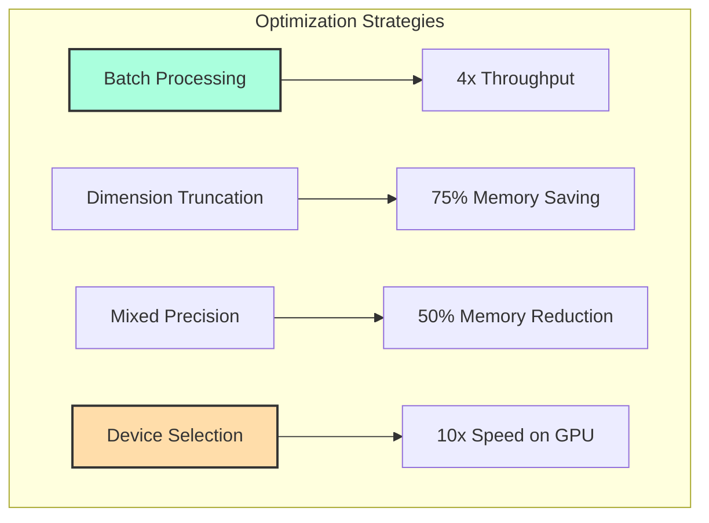

# Getting Started with Jina Embeddings v4

A comprehensive guide to using the professional Jina Embeddings v4 package for multimodal embeddings.

## Quick Installation Flow



## Installation

### System Requirements



### Installation Steps

```bash
# 1. Clone the repository
git clone https://github.com/jina-ai/jina-embeddings-v4.git
cd jina-embeddings-v4

# 2. Install the package
pip install -e .

# 3. Install with all extras (recommended)
pip install -e ".[all]"

# 4. For development
pip install -e ".[dev]"
```

## Basic Usage

### 1. Initialize the Model

```python
from jina_embeddings import JinaEmbeddings

# Default initialization
model = JinaEmbeddings()

# Custom configuration
model = JinaEmbeddings(
    model_name="jinaai/jina-embeddings-v4",
    device="cuda",  # or "mps" for Apple Silicon, "cpu" for CPU
    offline_mode=False
)
```

### 2. Text Embeddings

```python
# Single text
text = "Hello, World!"
embedding = model.encode_text(text)
print(f"Shape: {embedding.shape}")  # (1, 2048)

# Multiple texts
texts = [
    "Machine learning is fascinating",
    "Python is versatile",
    "Embeddings capture meaning"
]
embeddings = model.encode_text(texts)
print(f"Shape: {embeddings.shape}")  # (3, 2048)

# Task-specific encoding
query_emb = model.encode_text(
    "search query",
    task="retrieval",
    prompt_name="query"
)
```

### 3. Image Embeddings

```python
# Single image
image_embedding = model.encode_image("path/to/image.jpg")

# Multiple images
images = ["img1.jpg", "img2.png", "img3.webp"]
image_embeddings = model.encode_image(images)

# With PIL Image objects
from PIL import Image
pil_image = Image.open("photo.jpg")
embedding = model.encode_image(pil_image)
```

### 4. Cross-Modal Operations

```python
# Text-to-Image similarity
text_emb = model.encode_text("a photo of a cat")
image_emb = model.encode_image("cat.jpg")
similarity = model.cosine_similarity(text_emb[0], image_emb[0])
print(f"Cross-modal similarity: {similarity:.4f}")
```

## Processing Pipeline



## Configuration Management

### Using Config Files

```python
from jina_embeddings import Config

# Create configuration
config = Config()
config.device.preference = "cuda"
config.performance.batch_size = 32
config.embedding.default_dim = 2048

# Save configuration
config.save("my_config.json")

# Load configuration
loaded_config = Config.load("my_config.json")

# Print configuration
config.print_config()
```

### Environment Variables

```bash
# Set environment variables
export JINA_MODEL_NAME="jinaai/jina-embeddings-v4"
export JINA_DEVICE="cuda"
export JINA_BATCH_SIZE=32
export JINA_LOG_LEVEL="INFO"
export JINA_CACHE_DIR="~/.cache/jina"
```

### Configuration Structure



## Task-Specific Usage

### Retrieval Task

```python
# Document indexing
documents = [
    "Python is a programming language",
    "Machine learning uses algorithms",
    "Neural networks power AI"
]

doc_embeddings = model.encode_text(
    documents,
    task="retrieval",
    prompt_name="document"
)

# Query encoding
query = "artificial intelligence"
query_embedding = model.encode_text(
    query,
    task="retrieval",
    prompt_name="query"
)

# Find best match
similarities = [
    model.cosine_similarity(query_embedding[0], doc)
    for doc in doc_embeddings
]
best_idx = similarities.index(max(similarities))
print(f"Best match: {documents[best_idx]}")
```

### Classification Task

```python
# For classification
texts = ["positive review", "negative feedback", "neutral"]
embeddings = model.encode_text(texts, task="classification")

# Use with any classifier
from sklearn.linear_model import LogisticRegression
classifier = LogisticRegression()
# classifier.fit(embeddings, labels)
```

### Clustering Task

```python
# For clustering
embeddings = model.encode_text(texts, task="clustering")

# Use with clustering algorithms
from sklearn.cluster import KMeans
kmeans = KMeans(n_clusters=3)
clusters = kmeans.fit_predict(embeddings)
```

## Batch Processing



```python
# Efficient batch processing
texts = ["text"] * 1000  # Large dataset

embeddings = model.encode_text(
    texts,
    batch_size=32,
    show_progress=True
)

# Manual batching for control
batch_size = 32
all_embeddings = []

for i in range(0, len(texts), batch_size):
    batch = texts[i:i+batch_size]
    batch_emb = model.encode_text(batch)
    all_embeddings.append(batch_emb)

import numpy as np
final = np.vstack(all_embeddings)
```

## Device Optimization

### Automatic Detection

```python
from jina_embeddings.utils import DeviceManager

manager = DeviceManager()

# Get best device
device = manager.get_best_device()
print(f"Best device: {device}")

# Get optimization settings
settings = manager.optimize_for_device(device)
print(f"Optimal batch size: {settings['batch_size']}")
print(f"Precision: {settings['dtype']}")
```

### Device-Specific Settings



## Offline Usage



```python
# First run (downloads model)
model = JinaEmbeddings(offline_mode=False)

# Subsequent runs (fully offline)
model = JinaEmbeddings(offline_mode=True)
```

## Dimension Truncation (Matryoshka)



```python
# Generate full embeddings
embeddings = model.encode_text(texts)  # Shape: (n, 2048)

# Truncate for efficiency
embeddings_512 = embeddings[:, :512]   # 75% smaller, 97% performance
embeddings_256 = embeddings[:, :256]   # 87.5% smaller, 94% performance
embeddings_128 = embeddings[:, :128]   # 93.75% smaller, 90% performance
```

## Common Patterns

### Semantic Search System

```python
class SemanticSearch:
    def __init__(self):
        self.model = JinaEmbeddings()
        self.documents = []
        self.embeddings = []
    
    def index(self, documents):
        self.documents = documents
        self.embeddings = self.model.encode_text(
            documents,
            task="retrieval",
            prompt_name="document"
        )
    
    def search(self, query, top_k=5):
        query_emb = self.model.encode_text(
            query,
            task="retrieval",
            prompt_name="query"
        )[0]
        
        similarities = [
            self.model.cosine_similarity(query_emb, doc_emb)
            for doc_emb in self.embeddings
        ]
        
        top_indices = sorted(
            range(len(similarities)),
            key=lambda i: similarities[i],
            reverse=True
        )[:top_k]
        
        return [(self.documents[i], similarities[i]) 
                for i in top_indices]

# Usage
search = SemanticSearch()
search.index(["doc1", "doc2", "doc3"])
results = search.search("query", top_k=2)
```

### Image Search

```python
class ImageSearch:
    def __init__(self):
        self.model = JinaEmbeddings()
        self.image_paths = []
        self.embeddings = []
    
    def index_images(self, paths):
        self.image_paths = paths
        self.embeddings = self.model.encode_image(paths)
    
    def search_by_text(self, text, top_k=5):
        text_emb = self.model.encode_text(text)[0]
        
        similarities = [
            self.model.cosine_similarity(text_emb, img_emb)
            for img_emb in self.embeddings
        ]
        
        top_indices = sorted(
            range(len(similarities)),
            key=lambda i: similarities[i],
            reverse=True
        )[:top_k]
        
        return [(self.image_paths[i], similarities[i])
                for i in top_indices]
```

## Performance Tips



1. **Use Batching**: Process multiple items together
2. **Truncate Dimensions**: Use smaller embeddings when possible
3. **Select Right Device**: Use GPU/MPS when available
4. **Cache Results**: Avoid re-encoding same content
5. **Use Offline Mode**: After initial download

## Troubleshooting

### Common Issues

| Issue | Solution |
|-------|----------|
| Out of Memory | Reduce batch_size, use CPU for images |
| Slow Performance | Check device, enable optimizations |
| Download Fails | Check internet, use offline mode |
| Import Errors | Reinstall package, check Python version |

### Debug Mode

```python
import logging
logging.basicConfig(level=logging.DEBUG)

# Now model will show detailed logs
model = JinaEmbeddings()
```

## Next Steps

1. **Explore Examples**
   ```bash
   python examples/hello_world.py
   python examples/text_similarity.py
   python examples/multimodal_search.py
   ```

2. **Read Documentation**
   - [Architecture](./architecture.md) - Technical details
   - [API Reference](./api_reference.md) - Complete API
   - [Benchmarks](./benchmarks.md) - Performance data

3. **Build Applications**
   - Start with provided examples
   - Customize for your use case
   - Optimize for production

---

*Getting Started Guide - Jina Embeddings v4 Professional Package*