# VLLM Integration - Jina Embeddings v4

High-performance embedding generation using vLLM with Jina Embeddings v4 task-specific adapters.

## 🚀 Overview


## 📦 Installation

```bash
# Basic vLLM installation
pip install vllm

# With CUDA support
pip install vllm[cuda]

# For development
pip install vllm transformers torch
```

## 🎯 Available Adapters

### Adapter Comparison

```mermaid
graph LR
    subgraph "Task-Specific Adapters"
        A[Retrieval Adapter] --> B[Asymmetric Search<br/>Query ↔ Document]
        C[Text Matching] --> D[Symmetric Similarity<br/>Text ↔ Text]
        E[Code Search] --> F[Code Understanding<br/>NL ↔ Code]
    end
    
    style A fill:#fdd,stroke:#333,stroke-width:2px
    style C fill:#dfd,stroke:#333,stroke-width:2px
    style E fill:#ddf,stroke:#333,stroke-width:2px
```



| Adapter | Model Name | Use Case | File |
|---------|------------|----------|------|
| **Retrieval** | `jinaai/jina-embeddings-v4-vllm-retrieval` | Search, RAG, QA | `retrieval_example.py` |
| **Text Matching** | `jinaai/jina-embeddings-v4-vllm-text-matching` | Similarity, Dedup | `text_matching_example.py` |
| **Code Search** | `jinaai/jina-embeddings-v4-vllm-code` | Code Search, Docs | `code_search_example.py` |

## 💻 Quick Start

### Basic Usage

```python
from vllm import LLM
from vllm.config import PoolerConfig
from vllm.inputs.data import TextPrompt

# Initialize model
model = LLM(
    model="jinaai/jina-embeddings-v4-vllm-retrieval",
    task="embed",
    override_pooler_config=PoolerConfig(
        pooling_type="ALL",
        normalize=False
    ),
    dtype="float16"
)

# Generate embeddings
prompts = [TextPrompt(prompt="Query: Hello world")]
outputs = model.encode(prompts)
```

## 📊 Performance Architecture


## 🔧 Configuration Options

### Model Initialization

```python
model = LLM(
    model="jinaai/jina-embeddings-v4-vllm-retrieval",
    task="embed",
    override_pooler_config=PoolerConfig(
        pooling_type="ALL",      # Pooling strategy
        normalize=False          # Normalization
    ),
    dtype="float16",             # Precision: float16/float32/bfloat16
    max_model_len=8192,         # Max context length
    gpu_memory_utilization=0.8,  # GPU memory usage
    tensor_parallel_size=1,      # Multi-GPU setup
    trust_remote_code=True
)
```

### Prompt Formats


#### Text Prompts
```python
# Query format
query = TextPrompt(prompt="Query: What is machine learning?")

# Document format  
doc = TextPrompt(prompt="Passage: Machine learning is a subset of AI...")
```

#### Image Prompts
```python
from PIL import Image

image = Image.open("image.jpg")
image_prompt = TextPrompt(
    prompt="<|im_start|>user\n<|vision_start|><|image_pad|><|vision_end|>Describe.<|im_end|>\n",
    multi_modal_data={"image": image}
)
```

## 📈 Examples

### 1. Retrieval Example

```bash
python vllm_examples/retrieval_example.py
```

**Features:**
- Query-document matching
- Cross-modal search
- Document ranking
- RAG integration

### 2. Text Matching Example

```bash
python vllm_examples/text_matching_example.py
```

**Features:**
- Text similarity
- Multilingual matching
- Deduplication
- Paraphrase detection

### 3. Code Search Example

```bash
python vllm_examples/code_search_example.py
```

**Features:**
- Natural language to code
- Code similarity
- Documentation search
- Multi-language support

## ⚡ Performance Optimization

### Batch Processing


### Memory Management

```python
# Optimize GPU memory
model = LLM(
    model="jinaai/jina-embeddings-v4-vllm-retrieval",
    gpu_memory_utilization=0.8,  # Use 80% of GPU memory
    swap_space=4,                 # CPU swap space in GB
    cache_dtype="float16"         # Cache precision
)
```

### Multi-GPU Setup

```python
# Tensor parallel for large models
model = LLM(
    model="jinaai/jina-embeddings-v4-vllm-retrieval",
    tensor_parallel_size=2,       # Use 2 GPUs
    pipeline_parallel_size=1      # Pipeline stages
)
```

## 🎯 Use Case Selection

```mermaid
graph TD
    A[Use Case] --> B{Type?}
    B -->|Search Engine| C[Retrieval Adapter]
    B -->|Similarity| D[Text Matching]
    B -->|Code Search| E[Code Adapter]
    
    C --> F[Benefits:<br/>• Asymmetric search<br/>• Query optimization<br/>• Document ranking]
    D --> G[Benefits:<br/>• Symmetric similarity<br/>• Multilingual<br/>• Fast comparison]
    E --> H[Benefits:<br/>• Code understanding<br/>• NL to code<br/>• Multi-language]
    
    style B fill:#ffd,stroke:#333,stroke-width:2px
```



## 📊 Performance Benchmarks

### Throughput Comparison

| Method | Texts/sec | Memory | Latency | Best For |
|--------|-----------|---------|---------|----------|
| **vLLM** | 1000+ | Medium | Low | Production |
| **Transformers** | 100-200 | High | Medium | Development |
| **Sentence-Transformers** | 200-400 | Low | Medium | Simple cases |

### Scaling Performance


## 🛠️ Advanced Features

### Custom Pooling

```python
def custom_pooling(outputs):
    """Custom pooling strategy for embeddings."""
    embeddings = []
    for output in outputs:
        # Get hidden states
        hidden_states = output.outputs.data
        
        # Apply custom pooling (e.g., max pooling)
        pooled = torch.max(hidden_states, dim=0)[0]
        
        # Normalize
        normalized = torch.nn.functional.normalize(pooled, dim=-1)
        embeddings.append(normalized)
    
    return torch.stack(embeddings)
```

### Streaming Generation

```python
# Stream embeddings for large datasets
async def stream_embeddings(texts, batch_size=32):
    for i in range(0, len(texts), batch_size):
        batch = texts[i:i+batch_size]
        prompts = [TextPrompt(prompt=f"Query: {t}") for t in batch]
        outputs = await model.aencode(prompts)
        yield outputs
```

## 🐛 Troubleshooting

### Common Issues

| Issue | Solution |
|-------|----------|
| Out of Memory | Reduce `gpu_memory_utilization` or batch size |
| Slow Performance | Enable tensor parallelism, use float16 |
| Model Not Found | Check model name, internet connection |
| Import Error | Install vLLM with proper CUDA version |

### Debug Mode

```python
import logging
logging.basicConfig(level=logging.DEBUG)

# Enable vLLM debug logs
os.environ["VLLM_LOGGING_LEVEL"] = "DEBUG"
```

## 🔗 Integration with Main Package

### Using with jina_embeddings

```python
# Use vLLM for high-throughput scenarios
from vllm import LLM

# Use main package for development
from jina_embeddings import JinaEmbeddings

# Choose based on use case
if production_mode:
    model = LLM(model="jinaai/jina-embeddings-v4-vllm-retrieval", ...)
else:
    model = JinaEmbeddings()
```

## 📚 Additional Resources

- [vLLM Documentation](https://docs.vllm.ai)
- [Jina Embeddings v4 Paper](https://arxiv.org/abs/xxx)
- [Performance Tuning Guide](https://vllm.ai/tuning)
- [API Reference](../docs/api_reference.md)

---

*VLLM Integration - High-Performance Embeddings at Scale*